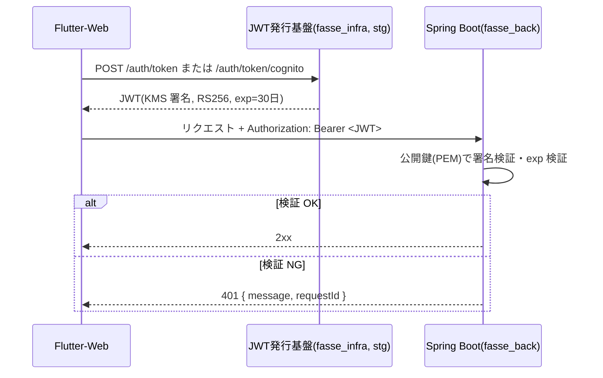

# design.md — WebAPI 受口の JWT 検証

## 1. 全体像

## 2. JWT の形式(発行基盤が発行するもの)

| 部位 | 内容 |
|---|---|
| ヘッダ | `{"alg":"RS256","typ":"JWT"}` |
| ペイロード | `sub`(メンバー識別子 / Cognito の sub)、`iss`、`iat`、`exp` |
| 署名 | KMS `Sign`(`RSASSA_PKCS1_V1_5_SHA_256`) |

## 3. Spring Security の構成

- 依存: `spring-boot-starter-security`、`spring-boot-starter-oauth2-resource-server`
- `SecurityFilterChain`(`common/security/SecurityConfig`)
  - セッションは使わない(`STATELESS`)。CSRF は無効(Cookie を使わない Bearer 認証のため)
  - CORS の preflight(`OPTIONS`)は認証なしで許可する
  - それ以外の全リクエストは `authenticated()`
  - `oauth2ResourceServer().jwt()` で `JwtDecoder` を使う
  - `authenticationEntryPoint` / `accessDeniedHandler` を独自実装し、401 を `{ "message", "requestId" }` 形式で返す
- `JwtDecoder`(`common/security/JwtDecoderConfig`)
  - `JWT_PUBLIC_KEY_PEM`(プロパティ `fasse.jwt.public-key-pem`)を起動時に `RSAPublicKey` へ変換し、`NimbusJwtDecoder.withPublicKey(key).signatureAlgorithm(RS256)` で生成する
  - 検証項目: 署名、`alg`=RS256、`exp`(必須)。時刻の許容誤差(clock skew)は 0 秒とする(Lambda と同じ判定にするため)
  - `iss` / `aud` は検証しない(Lambda と同じ。発行者は鍵で限定される)
  - 公開鍵が未設定・不正な場合は、起動を止めずに「常に検証失敗とする `JwtDecoder`」を登録し、WARN ログを出力する(フェイルクローズ)
- 認可: ロール・スコープによる制御は行わない(認証済みであれば全 API を利用できる)

## 4. エラー応答

| 状況 | ステータス | `message` |
|---|---|---|
| ヘッダ欠落・`Bearer` 以外 | 401 | `Authorization header is missing or malformed` |
| 形式不正・署名不正・`alg` 不一致・期限切れ・公開鍵未設定 | 401 | `Invalid or expired token` |

- WARN レベルで理由のみをログに出す(トークンの値は出さない)
- 401 レスポンスに `WWW-Authenticate: Bearer` ヘッダを付ける

## 5. トレース情報

- `common/web/RequestIdFilter`(Spring Security より前に動くフィルタ)でリクエストごとに UUID を採番し、MDC の `requestId` に設定、レスポンスヘッダ `X-Request-Id` にも付与する
- 認証成功後、MDC の `userId` に JWT の `sub` を設定する
- エラーレスポンスの `requestId` には MDC の `requestId` を使う

## 6. テスト方針

- テスト用の `JwtTestSupport` で RSA 鍵ペアを生成し、Nimbus で JWT を署名する。テスト用の公開鍵をプロパティに設定する
- `@WebMvcTest` + `SecurityConfig` で以下を検証する
  - 正常な JWT → 2xx
  - ヘッダ欠落、`Bearer` 以外の形式、形式不正、署名不正(別の鍵で署名)、`alg` 不一致(HS256)、期限切れ、`exp` 欠落 → 401 とレスポンス形式
- `JwtDecoderConfig` の単体テスト: 公開鍵未設定・PEM 不正で、常に検証失敗となる
